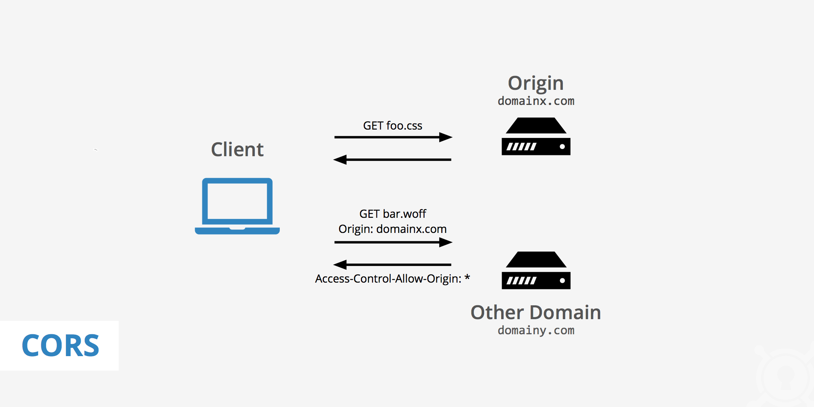
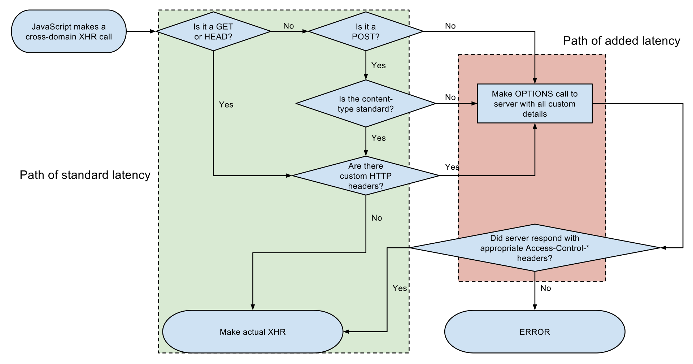
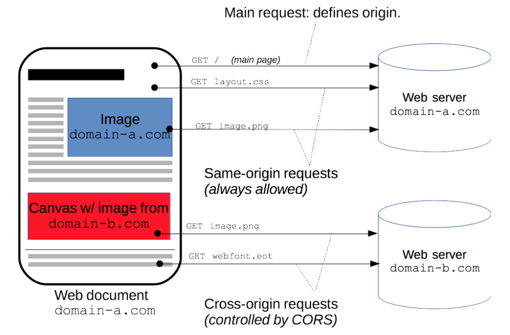
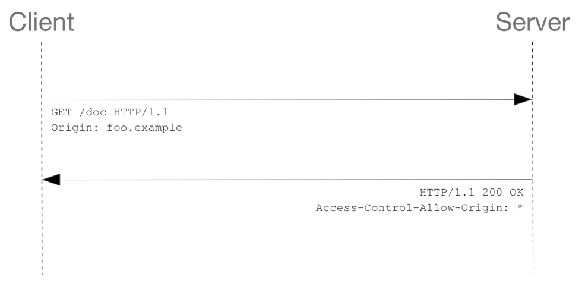
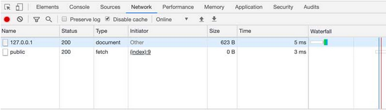
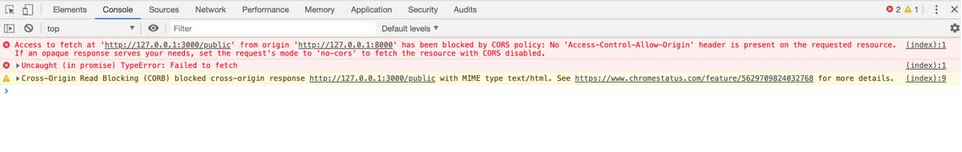
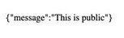
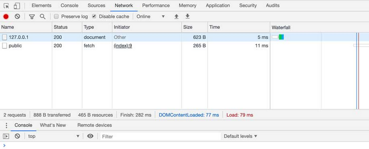
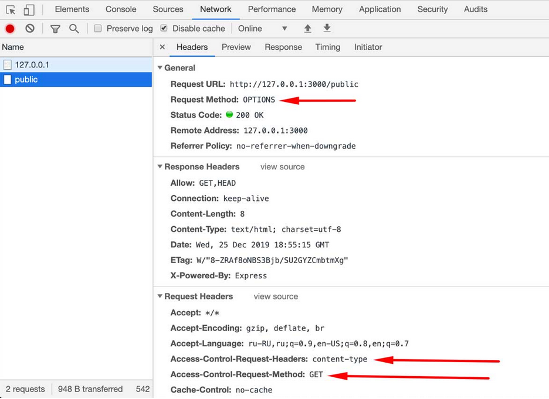

## CORS

CORS (Cross-Origin Resource Sharing "Спільне використання ресурсів між різними джерелами") - це система, що складається з відправки HTTP заголовків, які визначають: заблокувати або виконати запит до обмеженого ресурсу на веб-сторінці з іншого домену, відмінного від домену походження запитуваного ресурсу.

The same-origin security policy (рус. "Правило обмеження домену") за замовчуванням забороняє міждоменні запити. CORS надає веб-серверів можливість контролювати міждоменні запити і дозволяє робити безпечний обмін даними між різними доменами.



### Суть технології CORS

Є три домени, що дозволяють завантажити ресурси з сервера Z. Для того, щоб це стало можливим, веб-сервер Z, який віддає контент, досить вказати в заголовку відповіді

    Access-Control-Allow-Origin 

список довірених доменів: A, B, C. 

Тоді для сторінок цих доменів не діятимуть обмеження принципу однакового джерела на запитувані сторінки:

Access-Control-Allow-Origin: A, B, C

Після цього, сторінки доменів A, B, C зможуть завантажувати контент з сервера Z.



Приклад запиту на перехресне походження: інтерфейсний код JavaScript, що подається з https://domain-a.com, використовує XMLHttpRequest, щоб зробити запит на https://domain-b.com/data.json.

З міркувань безпеки веб-переглядачі обмежують HTTP-запити, що походять з ініціативи сценаріїв. Наприклад, XMLHttpRequest та Fetch API відповідають політиці того самого походження. Це означає, що веб-програма, що використовує ці API, може запитувати ресурси лише з того самого джерела, з якого завантажена програма, якщо відповідь з інших джерел не включає правильні заголовки CORS.



Механізм CORS підтримує безпечні запити перехресного походження та передачу даних між браузерами та серверами. Сучасні браузери використовують CORS в API, таких як XMLHttpRequest або Fetch, щоб зменшити ризики HTTP-запитів із походженням.


### Для корисно знати про СORS

Для всіх, але більш конкретно, ця стаття призначена для веб-адміністраторів, розробників серверів та розробників інтерфейсу. Сучасні браузери обробляють клієнтську сторону спільного використання з різними джерелами, включаючи заголовки та застосування політики. Але стандарт CORS означає, що сервери повинні обробляти нові заголовки запитів та відповідей.

### Огляд функцій

Стандарт Cross-Origin Resource Sharing працює, додаючи нові заголовки HTTP, які дозволяють серверам описувати, яким джерелам дозволено читати цю інформацію з веб-браузера. Крім того, для методів запитів HTTP, які можуть спричинити побічні ефекти на дані сервера (зокрема, методи HTTP, крім GET або POST з певними типами MIME), специфікація вимагає, щоб браузери "здійснювали попередню обробку" запиту, вимагаючи від сервера підтримуваних методів за допомогою методу запиту HTTP OPTIONS, а потім, після "схвалення" від сервера, відправлення фактичного запиту. Сервери також можуть інформувати клієнтів про те, чи слід надсилати із запитами "облікові дані" (наприклад, файли cookie та аутентифікацію HTTP).

Помилки CORS призводять до помилок, але з міркувань безпеки відомості про помилку вони недоступні для JavaScript. Код знає лише те, що сталася помилка. Єдиний спосіб визначити, що конкретно пішло не так, це заглянути в консоль браузера, щоб дізнатися деталі.

Подальші розділи обговорюють сценарії, а також надають розбивку використовуваних заголовків HTTP.

### Приклади сценаріїв контролю доступу

Ми представляємо три сценарії, які демонструють, як працює спільний доступ до ресурсів. Усі ці приклади використовують XMLHttpRequest, який може робити міжсайтові запити в будь-якому підтримуваному браузері.

#### Прості запити

Деякі запити не ініціюють попередню перевірку CORS. У цій статті їх називають "простими запитами", хоча специфікація Fetch (що визначає CORS) не використовує цей термін. "Простий запит" - це той, який відповідає всім наступним умовам:

1. Один із дозволених методів:

- GET
- HEAD
- POST

2. Окрім заголовків, автоматично встановлених користувальницьким агентом (наприклад, Connection, User-Agent або інші заголовки, визначені в специфікації Fetch як «заборонене ім'я заголовка»), єдиними заголовками, які дозволяється встановлювати вручну, є ті, які специфікація Fetch визначає як “заголовок запиту, що входить до списку CORS”, а саме:

- Accept
- Accept-Language
- Content-Language
- Content-Type
3. Єдиними дозволеними значеннями для заголовка Content-Type є

- application/x-www-form-urlencoded
- multipart/form-data
- text/plain

Наприклад, припустимо, веб-вміст за адресою https: //foo.example бажає викликати вміст у домені https: //bar.other. Код такого роду може використовуватися в JavaScript, розгорнутий на foo.example:

```js
const xhr = new XMLHttpRequest();
const url = 'https://bar.other/resources/public-data/';

xhr.open('GET', url);
xhr.onreadystatechange = someHandler;
xhr.send();
```

Це виконує простий обмін між клієнтом та сервером, використовуючи заголовки CORS для обробки привілеїв:



Давайте подивимося, що браузер надішле серверу в цьому випадку, і подивимося, як сервер реагує:

    GET /resources/public-data/ HTTP/1.1
    Host: bar.other
    User-Agent: Mozilla/5.0 (Macintosh; Intel Mac OS X 10.14; rv:71.0) Gecko/20100101 Firefox/71.0
    Accept: text/html,application/xhtml+xml,application/xml;q=0.9,*/*;q=0.8
    Accept-Language: en-us,en;q=0.5
    Accept-Encoding: gzip,deflate
    Connection: keep-alive
    Origin: https://foo.example

Заголовок запиту примітки - Origin, який показує, що виклик надходить із https://foo.example.

    HTTP/1.1 200 OK
    Date: Mon, 01 Dec 2008 00:23:53 GMT
    Server: Apache/2
    Access-Control-Allow-Origin: *
    Keep-Alive: timeout=2, max=100
    Connection: Keep-Alive
    Transfer-Encoding: chunked
    Content-Type: application/xml

    […XML Data…]

У відповідь сервер надсилає назад заголовок Access-Control-Allow-Origin із Access-Control-Allow-Origin: *, що означає, що доступ до ресурсу може здійснюватися з будь-якого джерела.

    Access-Control-Allow-Origin: *

Цей шаблон заголовків Origin та Access-Control-Allow-Origin є найпростішим використанням протоколу контролю доступу. Якщо власники ресурсів на https: //bar.other бажали обмежити доступ до ресурсу лише запитами з https: //foo.example, (тобто жоден домен, крім https: //foo.example, не може отримати доступ до ресурсу в міжсайтовий спосіб) вони надсилатимуть:

    Access-Control-Allow-Origin: https://foo.example    

### Практична реалізація 

Нехай в нас створено тестовий веб-сайт на Node.js з відкритим API та запущено його за адресою http://127.0.0.1:3000.

```js
const express = require('express')
const session = require('express-session');
const app = express()
const port = 3000
const sessionOptions = {
  secret: '123456',
  cookie: {
    maxAge:269999999999
  },
  saveUninitialized: true,
  resave:true
};
app.use(session(sessionOptions));
app.get('/', (request, response) => {
    response.send('Hello from Express!')
})
app.listen(port, (err) => {
    if (err) {
        return console.log('something bad happened', err)
    }
    console.log(`server is listening on ${port}`)
})
```

Нехай там буде приблизно така функція отримання GET запиту:

```js
app.get('/public', function(req, res) {
  res.send(JSON.stringify({
    message: 'This is public'
  }));
})
```
Нехай там також буде проста функція входу в систему, де користувачі вводять загальне секретне слово secret і їм потім  встановлюється cookie, ідентифікуючи їх як прошедшими аутентифікацію:

```js
app.post('/login', function(req, res) {
  if(req.body.password === 'secret') {
    req.session.loggedIn = true
    res.send('You are now logged in!')
  } else {
    res.send('Wrong password.')
  }
})
```
І нехай у нас буде якесь приватне API для яких небудь особистих даних в / private, тільки для аутентіфікованих користувачів.

```js
app.get('/private', function(req, res) {
  if(req.session.loggedIn === true) {
    res.send(JSON.stringify({
      message: 'THIS IS PRIVATE'
    }))
  } else {
    res.send(JSON.stringify({
      message: 'Please login first'
    }))
  }
})
```

### Запит нашого API через AJAX з інших доменів

Припустимо в нас є якась клієнтська програма, що працює з нашим API. Але врахуємо що, наше API знаходиться за адресою http://127.0.0.1:3000/public, а наш клієнт розміщений на http://127.0.0.1:8000, і на клієнті є наступний код:

```js
fetch('http://127.0.0.1:3000/public')
  .then(response => response.text())
  .then((result) => {
    document.body.textContent = result
  })
```

І це не буде працювати!

Якщо ми подивимося на вкладку network в консолі Хрома при зверненні c http://127.0.0.1:8000 до http://127.0.0.1:3000 то там не буде помилок:



Сам по собі запит був успішним, але результат виявився недоступний. Опис причини можна знайти в консолі JavaScript:



Нам не вистачає заголовка Access-Control-Allow-Origin!

### Same-Origin Policy

Причиною, через яку ми не отримаємо відповідь у JavaScript, є Same-Origin Policy. Ця обмежувальна міра була придумана розробниками браузерів що б веб-сайт не міг отримати відповідь на згенерований AJAX запит до іншого веб-сайту знаходиться за іншою адресою.

Наприклад: якщо ви заходите на sample.org, ви б не хотіли, щоб цей веб-сайт відправляв запит наприклад на ваш банківський веб-сайт і отримував баланс вашого рахунку і транзакції.

Same-Origin Policy запобігає саме це.

«Джерело (origin)» в цьому випадку складається з

- протокол (наприклад http)
- хост (наприклад example.com)
- порт (наприклад 8000)

Так що http://sample.org і http://www.sample.org і http://sample.org:3000 - це три різних джерела.

### CSRF

Зверніть увагу, що існує клас атак, званий підробкою міжсайтових запитів (Cross Site Request Forgery - csrf), від яких не захищає Same-Origin Policy.

При CSRF-атаці зловмисник відправляє запит сторонньої сторінці в фоновому режимі, наприклад, відправляючи POST запит на веб-сайт вашого банку. Якщо у вас в цей момент є дійсний сеанс з вашим банком, будь-який веб-сайт може згенерувати запит в фоновому режимі, який буде виконаний, якщо ваш банк не використовує контрзаходи проти CSRF.

Так само зверніть увагу, що, незважаючи на те, що діє Same-Origin Policy, наш приклад запиту з сайту secondparty.com на сайті 127.0.0.1:3000 буде успішно виконано - ми просто не зможемо отримати доступ до результатів. Але для CSRF нам не потрібен результат.

Наприклад, API, який дозволяє відправляти електронні листи, виконуючи POST запит, відправить електронного листа, якщо ми надамо йому правильні дані. Зловмиснику не потрібно піклуватися про результат, його турбота це відправлення електронного листа, який він отримає незалежно від можливості бачити відповідь від API.

### Включення CORS для нашого публічного API

Припустимо нам потрібно дозволити роботу JavaScript на сторонніх сайтах (наприклад, 127.0.0.1:8000) що б отримувати доступ до наших відповідей API. Для цього нам потрібно включити CORS в заголовок відповіді від сервера. Це робиться на стороні сервера:

```js
app.get('/public', function(req, res) {
  res.set('Access-Control-Allow-Origin', '*')
  res.send(...)
})
```

Тут ми встановлюємо заголовку Access-Control-Allow-Origin значення *, що означає: що будь-якому хосту дозволений доступ до цього URL і відповіді в браузері:





### Непрості запити і попередні запити (preflights)

Попередній приклад був так званим простим запитом. Прості запити - це:

Запити: GET, POST
Тип вмісту наступного:
- text / plain
- application / x-www-form-urlencoded
- multipart / form-data

Припустимо тепер 127.0.0.1:8000 трохи змінює реалізацію, і тепер він обробляє запити в форматі JSON:

```js
fetch('http://127.0.0.1:3000/public', {
  headers: {
    'Content-Type': 'application/json'
  }
})
  .then(response => response.json())
  .then((result) => {
    document.body.textContent = result.message
  })
```

Але це знову все ламає!
На цей раз консоль показує іншу помилку:



Будь-який заголовок, який не дозволений для простих запитів, вимагає попереднього запиту (preflight request).

Цей механізм дозволяє веб-серверам вирішувати, чи хочуть вони дозволити фактичний запит. Браузер встановлює заголовки 

    Access-Control-Request-Headers 

і 
    
    Access-Control-Request-Method, 
    
щоб повідомити сервер, який запит очікувати, і сервер повинен відповісти відповідними заголовками.

Але наш сервер ще не відповідає з цими заголовками, тому нам потрібно додати їх:

```js
app.options('*', (req, res) => {
  res.set('Access-Control-Allow-Origin', '*');
  res.set("Access-Control-Allow-Headers", "Content-Type");
  res.send('ok');
});
app.get('/public', function(req, res) {
  res.set('Access-Control-Allow-Origin', '*')
  res.set('Access-Control-Allow-Methods', 'GET, OPTIONS')
  res.set('Access-Control-Allow-Headers', 'Content-Type')
  res.send(JSON.stringify({
    message: 'This is public info'
  }))
})
```
Тепер ми знову може отримати доступ до відповіді.

### Credentials и CORS

Тепер давайте припустимо, що нам потрібно залягання на 127.0.0.1:3000 що б отримати доступ до private з конфіденційною інформацією.

При всіх наших налаштуваннях CORS, чи може інший сайт так само отримати цю конфіденційну інформацію?

Результат:

```js
fetch('http://127.0.0.1:3000/private')
  .then(response => response.text())
  .then((result) => {
    let output = document.createElement('div')
    output.textContent = result
    document.body.appendChild(output)
  })
```

Незалежно від того, спробуємо ми залягання на 127.0.0.1:3000 чи ні, ми побачимо «Please login first».

Причина в тому, що cookie від 127.0.0.1:3000 НЕ будуть відправлятися, коли запит надходить з іншого джерела. Ми можемо попросити браузер відправити файли cookie клієнту, навіть якщо запит з інших доменів:

```js
fetch('http://127.0.0.1:3000/private', {
  credentials: 'include'
})
  .then(response => response.text())
  .then((result) => {
    let output = document.createElement('div')
    output.textContent = result
    document.body.appendChild(output)
  })
```

Але знову це не буде працювати в браузері. І це хороша новина, насправді.

Отже, ми не хочемо, щоб зловмисник мав доступ до приватних даними, але що, якщо ми хочемо, щоб 127.0.0.1:8000 мав доступ к / private?
У цьому випадку нам потрібно встановити для заголовка Access-Control-Allow-Credentials значення true:

```js
app.get('/private', function(req, res) {
  res.set('Access-Control-Allow-Origin', '*')
  res.set('Access-Control-Allow-Credentials', 'true')
  if(req.session.loggedIn === true) {
    res.send('THIS IS THE SECRET')
  } else {
    res.send('Please login first')
  }
})
```
Але це все одно поки що не спрацює. Це небезпечна практика - виконувати будь-які аутентифіковані запити з інших джерел.

Браузер не дозволить нам так легко зробити помилку.

Якщо ми хочемо вирішити 127.0.0.1:8000 доступ к / private, нам потрібно вказати точне джерело в заголовку:

```js
app.get('/private', function(req, res) {
  res.set('Access-Control-Allow-Origin', 'http://127.0.0.1:8000')
  res.set('Access-Control-Allow-Credentials', 'true')
  if(req.session.loggedIn === true) {
    res.send('THIS IS THE SECRET')
  } else {
    res.send('Please login first')
  }
})
```

Тепер http://127.0.0.1:8000 також має доступ до приватних даними, в той час як запит з будь-якого іншого сайту буде заблокований.

### Висновок

У цій статті розглянуто Same-Origin Policy і способи, як ми можемо використовувати CORS, щоб дозволяти запити між джерелами, коли це необхідно.

Це вимагає налаштування на стороні сервера і на стороні клієнта і в залежності від запиту виклик попереднього (preflight) запиту.

При роботі з аутентифікованим запитом перехресного походження слід проявляти додаткову обережність. Білий список може допомогти вирішити декількох джерел без ризику витоку конфіденційних даних (які захищені аутентификацией).

Короткі висновки з доповіді:

* Браузер використовує Same-origin policy, щоб не обробляти AJAX відповіді від веб-сайтів розташованих на адресах відмінних від адреси з якого була завантажена веб сторінка.

* Same-origin policy не забороняє генерувати запити до інших сайтів, але забороняє обробляти від них відповідь.

* CORS (Cross-Origin Resource Sharing) механізм, який використовує додаткові заголовки HTTP, щоб дати браузерам вказівку надати веб-додатку, що працює в одному джерелі, доступ до відповіді на запит до ресурсів з іншого джерела.

* CORS разом з credentials (з даними аутентифікації) вимагає обережності.
    
* CORS це браузерна політика. Інші додатки не будуть зачіпатися цим поняттям.