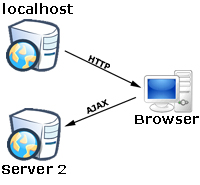
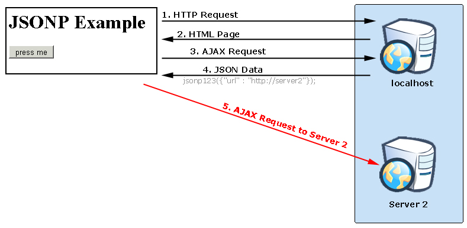

## JSONP

JSONP или «JSON with padding» - це доповнення до базового формату JSON. Він пропонує можливість запросити дані із сервером, що знаходяться в іншому домені - операцію, заблоковану в типових веб-браузерах із-за політики обмеження домену.

Відповідно до політики обмежень домену, веб-сторінки, розміщеної на сервері example1.com, не можна зв’язатися з сервером, відмінним від example2.net. 
На основі технологій JSONP розміщений той факт, що політика безпеки браузера не забороняє використовувати HTML-елемент      

```html
<script type = "text / javascript" src = "..." /> 
```

для обробки серверів, відмінних від сервера, з якого було запущено сторінки завантаження. 

Використовуючи відкриту політику для елементів 
script деякі сторінки використовують їх для завантаження JavaScript-коду, який оперує динамічно створеними JSON-даними з інших джерел. Запроси для JSONP отримують не JSON, а виробничий JavaScript-код.

Вони обробляють інтерпретатор JavaScript, а не парсером JSON. Існують серйозні проблеми, пов'язані з безпекою при використанні JSONP, у більшості ситуацій використання CORS є найкращим вибором.

Схему роботи паттерна можна описати, скориставшись запросом за деяким URL, повертаючи дані JSON. Програма на JavaScript може запросити цей URL, до прикладу, за допомогою XMLHttpRequest. 

Представимо, що UserId об'єкта Foo дорівнює 1234. Браузер, що запитує URL 

    http://server2.example.com/Users/1234

передав ідентифікатор 1234 та отримав відповідь наступного формату:

```json
{
    "Name": "Foo",
    "Id": 1234,
    "Rank": 7
}
```

JSON-дані у відповіді стороннього сервера зазвичай створюються динамічно, в залежності від параметрів запиту, переданих в URL.

Нижче HTML-елемент script вказує в якості атрибута src посилання, що повертає JSON:

```html
<script type="application/javascript" src="http://server2.example.com/Users/1234">

</script>
```

У свою чергу, браузер завантажить файл script, розбере його вміст, інтерпретує сирі JSON-дані як блок і викине помилку синтаксису. Навіть якщо дані були інтерпретовані як літеральний об'єкт JavaScript, до нього неможливо отримати доступ з JavaScript, що виконується в браузері, оскільки без присвоєння змінної об'єктні літерали недоступні.

Наприклад, у паттерні JSONP URL, на який вказує атрибут src тега script, повертає дані JSON, загорнуті в виклик функції. У подібному випадку функція, вже виявлена в середовищі JavaScript, може маніпулювати JSON-даними. Начинка JSONP може виглядати так:

```json
functionCall({"Name": "Foo", "Id": 1234, "Rank": 7});
```

Виклик функції - це і є «P» в слові JSONP - «padding» (набивка, «відступ») навколо чистого JSON, або, згідно з деякими джерелами - «префікс». За угодою, браузер передає ім'я функції зворотного виклику як іменований параметр запиту, зазвичай використовуючи ім'я jsonp або callback в запиті до сервера, тобто

```html
<script type="text/javascript" src="http://server2.example.com/Users/1234?jsonp=parseResponse"> 

</script>
```

В даному прикладі начинка буде така:

```json
parseResponse({"Name": "Foo", "Id": 1234, "Rank": 7});
```

### Запит
#### Простий приклад запиту:

```js
function addScript(src) {
  var elem = document.createElement("script");
  elem.src = src;
  document.head.appendChild(elem);
}

addScript('user?id=123');
```

Такий виклик додасть в <head> документа тег:

```js
<script src="user?id=123"></script>
```

При додаванні тега script з зовнішнім src в документ браузер тут же починає його завантажувати, а потім - виконує.

В даному випадку браузер запросить скрипт з URL     
    
    / user? Id = 123 

і виконає.

### Обробка відповіді, JSONP

В наведеному вище прикладі розглянуто створення запиту, але як отримати відповідь? Припустимо, сервер хоче надіслати об'єкт з даними.

Звичайно, він може привласнити її в змінну, наприклад так:

```js
// відповідь сервера
var user = {name: "Віта", age: 19 };
```

Браузер по script.onload відловить закінчення завантаження і прочитає значення user.

Але що буде, якщо одночасно робиться кілька запитів? Виходить, потрібно присвоювати в різні змінні.

Протокол JSONP якраз і покликаний полегшити це завдання.

Він дуже простий:

- Разом із запитом клієнт в спеціальному, заздалегідь обумовленому, параметрі передає назва функції.
Зазвичай такий параметр називається callback. наприклад:

```js
addScript('user?id=123&callback=onUserData');
```
- Сервер кодує дані в JSON і обертає їх в виклик функції, назва якої отримує з параметра callback:

```js
// відповідь сервера
onUserData({
  name: "Віта",
  age: 19
});
```

#### JSONP та однакова політика поxодження

З’єднання AJAX з JavaScript - це невелика технологія, яка революціонізує Інтернет, але вони мають суворі обмеження з тією ж політикою походження. У Java, C ++, C # або будь-якій іншій мові клієнтського рівня я можу виконати запрос на будь-який потрібний сервер, але не в JavaScript.

Виклик на інші сервери дозволяє зробити дуже захоплюючі речі:

* Створення гнучкою архітектури додатків, які розділяють код, який ви пишете, на різні сервери.
* Виклик API на основі REST.
* Код доступу зі сторонніх систем, таких як, наприклад, Twitter.



Те саме походження запобігає цьому через проблеми безпеки. Якщо JavaScript міг викликати інші сервери, то шкідлива програма JavaScript може зачекати, поки ви завантажите інший сайт, а потім передати інформацію назад на інший сервер. Ці проблеми важко вирішити в загальному випадку, але для конкретних застосувань ними можна керувати. У цій доповіді наводжу робочий приклад того, як обійти ту саму проблему походження, яка називається JSONP.

JSONP - це підмножина нотації об'єктів JavaScript (JSON). JSON дозволяє серверу надсилати дані назад у JavaScript у форматі, який дуже легко та швидко читається JavaScript.

#### Як це працює

Давайте детально розглянемо, як працює JSONP та цей приклад:

1. Клієнт починає з подачі запиту на сервер. Сервер відповідає деяким HTML, який містить трохи JavaScript. Потім JavaScript використовує AJAX для переадресації на той же сервер і запиту деяких даних JSON. Сервер надсилає дані JSON.

2. Тепер відбувається магія. Оскільки сервер з тим самим початком, що і HTML, надіслав URL-адресу як частину даних JSON, ми можемо використовувати цю URL-адресу для підключення до другого сервера. JavaScript довіряє URL-адресі, оскільки вона надійшла з оригінального сервера. Ось чому працює JSONP.

Якщо ви спробували здійснити це із стандартним JSON, ви отримаєте виняток безпеки, зв’язавшись із другим сервером. JSONP приймає ваш запит JSON і розміщує його, щоб ви могли зателефонувати іншому серверу.

Код усього цього насправді досить простий. Все знаходиться у  form.html .

```js
function jsonptest() {
    output("Starting the JSONP test...");
    output("Making a request to jsonp.srv");
    $.ajax({
        dataType: 'jsonp',
        data: 'id=10',
        jsonp: 'jsonp_callback',
        url: 'jsonp.srv?dojsonp=true',1
        success: function () {
            alert("success...")
        },
    });
}

function jsonp123(data) {2
    output("Received a response from jsonp.srv");
    output("Calling to: " + data.url);
    $.ajax({
        dataType: 'jsonp',
        data: 'id=10',
        jsonp: 'jsonp_callback',
        url: data.url,3
        success: function () {
            alert("success...")
        },
    });
}

function done(data) {4
    output(data.message);
}
```

### Коментар
Коли ви натискаєте кнопку, вона викликає функцію jsonptest. Ця функція використовує JQuery для здійснення виклику AJAX до сервера -  **1** 

Сервер повертає деякі дані JSON, які автоматично викликають функцію jsonp123 -   **2**

Ця функція бере URL-адресу із сервера і робить виклик AJAX другому серверу - **3**. 

Другий сервер обробляє запит і повертає структуру даних JSON, яка викликає виконану функцію - **4**



Код сервера ще простіше.

```js
response.setContentType("application/json");
PrintWriter out = response.getWriter();

if (request.getRequestURL().indexOf(SECOND_SERVER_URL) > -1) {1
    String s = "done({\"message\" : \"You successfully bypassed the same origin " + 
                       "and made a request to " + request.getRequestURL() + "\"});";
    out.println(s);
    return;
}
String s = " jsonp123({\"url\" : \"" + SECOND_SERVER_URL + 
           "/jsonptest/jsonp.srv\"});";2
out.println(s);
```

### Коментар

Якщо запит надійшов до другої URL-адреси сервера, наш сервлет поверне набір даних JSON, який викликає виконану функцію - **1**

В іншому випадку він викличе функцію jsonp123. Це насправді все, що є в цьому.

Ця ж політика походження є переважною для більшості випадків, але оскільки веб-сайти стають веб-додатками, їм потрібна додаткова гнучкість та потужність виклику інших серверів. JSONP трохи складний, але працює. Це може допомогти вашій заявці, але це, безумовно, код коледжу. Ніколи не використовуйте JSONP без хорошого плану управління проблемами безпеки та дуже захисного кодування.


#### Далі про реалізацію JSON та JSONP запитів -  [тут](./realization.md)
#### Далі про СORS -  [тут](./CORS.md)

